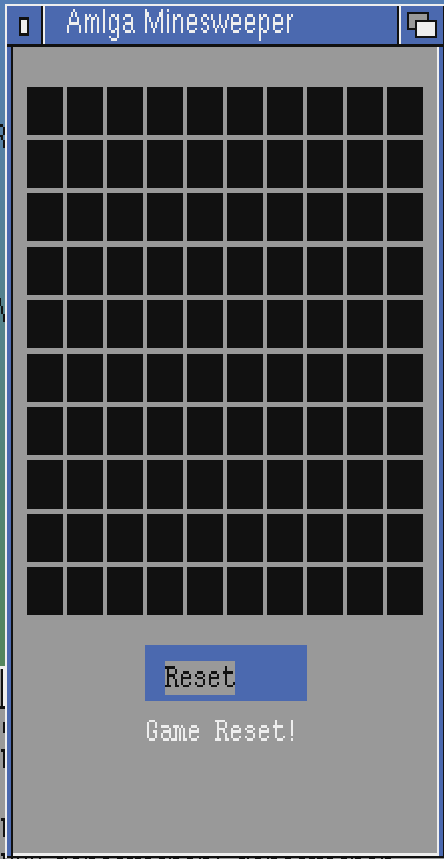

# AmIga Minesweeper

A fully functional **Minesweeper** game for the **Commodore Amiga**, developed in **C** and designed to run on classic Amiga systems and emulators like **WinUAE**.

This game features modern Minesweeper mechanics while staying true to the retro charm of the Amiga platform.

AI was used to make this project over a space of 7 hours, Amiga Guru on ChatGPT

---

## **Features**

- 🕹️ **Classic Minesweeper Gameplay**: Flag mines, reveal cells, and avoid hidden mines!
- 🎨 **Intuitive Interface**: A clean and responsive graphical interface using Amiga's Intuition library.
- 💥 **Explosion Effects**: When you hit a mine, watch the grid explode and shake!
- 🎶 **Sound Effects**: A satisfying beep sound plays when you trigger a mine.
- 🖱️ **Mouse Controls**:
   - **Left-click**: Reveal a cell.
   - **Right-click**: Flag a suspected mine.
- 🔄 **Reset Button**: Restart the game without closing the window.
- ✅ **Game Status Messages**:
   - **"BOOM! Game Over!"** when you hit a mine.
   - **"Congratulations! You Win!"** when you flag all the mines correctly.

---

## **Screenshots**

### **Gameplay**


---

## **System Requirements**

To run Amiga Minesweeper, you'll need:

- **Hardware**: 
   - Any classic Amiga computer with at least **1MB of Chip RAM**.
- **Software**:
   - AmigaOS 2.0+ (Workbench).
   - Works on emulators such as **WinUAE** or **FS-UAE**.

---

## **Installation**

1. **Compile the Game** (optional):
   - Requires **VBCC** or **GCC (m68k-amigaos)** cross-compiler toolchain.
   - Compile using:
     ```bash
     m68k-amigaos-gcc -O2 -o minesweeper minesweeper.c 
     ```
2. **Run the Game**:
   - Copy the `minesweeper` executable to your Amiga.
   - Run the game from Workbench or AmigaShell:
     ```bash
     minesweeper
     ```

---

## **Controls**

- **Left-Click**: Reveal a cell.
- **Right-Click**: Flag or unflag a mine.
- **Reset Button**: Restart the game after a win or game over.

---

## **Building the Code**

If you'd like to build this project yourself:

1. Install the **AmigaOS cross-compilation toolchain** (e.g., `m68k-amigaos-gcc`).
2. Clone this repository:
   ```bash
   git clone https://github.com/yourusername/amiga-minesweeper.git
   cd amiga-minesweeper
